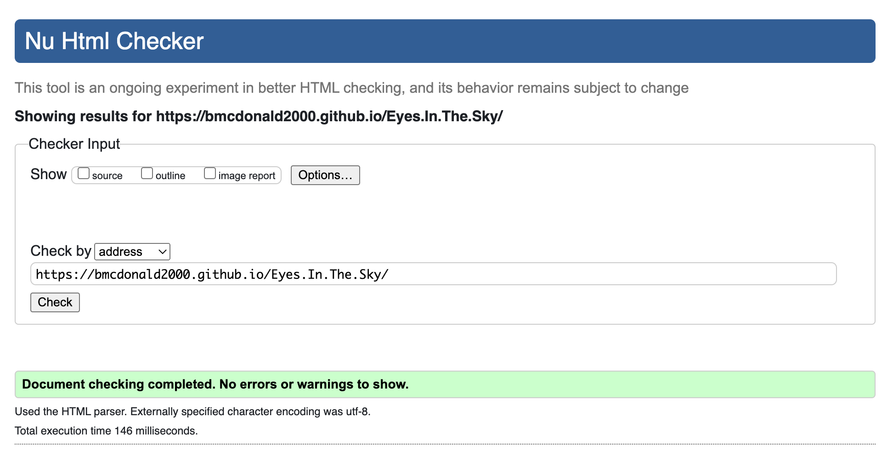
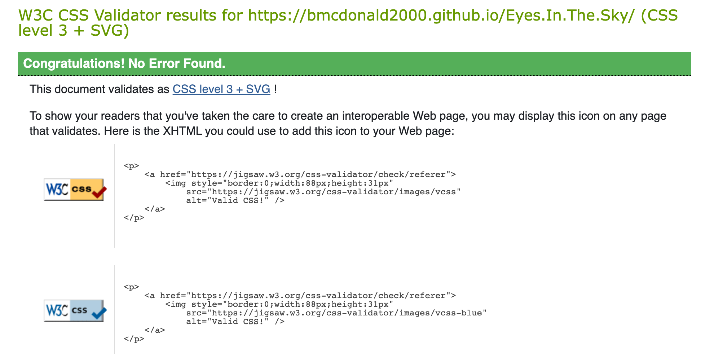

# Eyes In The Sky 

:globe_with_meridians: [Live Website])(https://bmcdonald2000.github.io/Eyes.In.The.Sky/)

 [Github repository](https://github.com/bmcdonald2000/Eyes.In.The.Sky)

## What is Eyes In The Sky ? :bulb:

Eyes In The Sky is a weather application that provides live and forecast weather data based on the users location or a location of their choice. Eyes In The Sky is useful for individuals who wish to plan their day/week in occordance to the weather. The ability to check both global and local weather is particularly useful to users planning to take a trip abroad.

<strong>Table of contents:</strong>

 

[User Experience (UX)](##User-Experience-(UX))

[Features](##Features)

[Technologies used](##Technologies-used)

[Testing](##Testings)

[Deployment](##Deployment)

[Known bugs](##Known-bugs)

[Credits](##Credits)

## User Experience (UX) 

### User Stories :scroll:

• As a user, I want to be able to acess weather data on my mobile so I can check the weather whislt on the go.
• As a user, I want to be able to check the hourly weather for the current days weather.
• As a user, I want to be able to input my own location into an input field in order to get weather data for any desired location.
• As a user, I want to be able to successfully submit my input in order to retrieve weather data for my input.
• As a user, I want some sort of feedback to let me know my search request was processed.
• As a user, I want to be able to use my device's location in order to get weather data without needing to type in my location.
• As a user, I want to be able to view the results of my successful search so that I can know the weather.
• As a user, I want to view the future weather for my searched location so that I know what the weather will be like for the rest of the week.

### Design :art:

The main goal was to make an intuitive UX, so that the user is not confused when visiting the Website. To achieve this, I created a simple, succinct, one-page web application. Once the page has loaded the user sees a searchbar with place holder text, that tells them to enter a location. There is also a set of instructions below the text to insure the user understands the button functions.

The users desired results needed to be obtained with ease. This was achieved by using a 'Current Location' button, so they can get search results within one click, limiting the number of user actions to generate weather data.

The user needs to be able to easily access weather data from any device. To ensure this was possible I have enabled a scroll function so overflow is visble and kept the UX design simple so that it can be easily adjusted across all viewport sizes without the user loosing access to any functions or information.

The results of the search also needed to be clear , partciuarly for those using smaller viewports. The REST API that collected Weather Data had lots of data that could be displayed, so I eliminated any unncessary data so that the user only provided with  useful data. To help me determine which information was the most useful, I compared the the kind of data available on popular weather apps. Then tailored this to the needs of my target audience.

 **• Colour scheme**

   ° I have gone for a complimentary colour palette, which I desgined using [canva](https://www.canva.com/colors/color-wheel/). The overall theme of the site is blue(#419AFF) and orange (#FFA641) as these are colours of the  sky and sun, thus commonly associated with the weather,  tying in with the purpose of the app. To make things easy for the user I used a monchrome design for the text. All hourly and forecasted weather data is displayed in white font (#000000) and a black background (#000000ec), an opaque black was used to create enough contrast between the animated background and the text for it to be visible, but not so much that it distracts the user from the animation or disrupts the fluidity of the design. Where a white font was not suitable I have used black (#ffffff).

**• Typography**

   ° In keeping with the simple style of the website, I have chosen to use a Thai and Latin family font 'Mali' as it has a carefree feel and is easy to read. I want the users to be carefree whislt using the site as the purpose of the site is to alow the users to retrived their desired data in a stress free way. 

 **• Imagery**

   ° The weather icons seen on the site are from the [Rest API](https://openweathermap.org/api). 
   ° The icons used for the buttons and the loader are from [font awesome](https://fontawesome.com/v6.0)
   ° The animated backgrounds used are from [pexels](https://www.pexels.com/).

**• Wireframes**

   °  Wireframes were created using [Figma](https://www.figma.com/). To meet my UX objective of  creating a simple and intuitive User Interface (UI), I initially used a different colour schemes but further into the development I  realised greater contrast was required in order to engage the User. I also decided to include animated background and more craetive button styling, keeping inline with the simplistic theme but improving user engagement.  Here is the link to [my wireframes](https://www.figma.com/file/4BqP3k0Ta5XqvtWtveeFtR/Wire-Frames?node-id=0%3A1) for desktop and mobile. Below are screenshots of the desktop and mobile Wireframes. :point_down:

  **Desktop:** :desktop_computer:

  **Mobile:** :iphone:

## Features :dart:

### Current features

##### Instructions container
When the user visits the web application, there are a few simple instructions that allow the user to understand how to use the site.

##### Current Location Weather
The user can click the location button, the browser will then ask the user permission to access their device's location. Once that is accepted, the weather results shown will be for that location - using latitude and longitude of the User's device. This button uses the Geolocation API.

##### Global button
Alternatively, the user can enter a location of their choice into the searchbar. Then click the global button, the weather API will return weather data for that location, provided the input is valid. Otherwise an error message will occur and the user will be prompted to try again.

##### Live Weather
When the user clicks either button, the app will display the current weather, location and any key information about the location. (Temperature, Weather,Humidity, Wind Speed, Pressure, Feels like, Highs and Lows). 

More information could have been added, but this could have potentially overwhelmed the user so instead I decided that this information was most important to a user seeking live weather information. 

##### Hourly Weather
To ensure the user recives the most accurate weather information for the day, hourly weather data for that location, is also displayed below the Live weather data.

##### Forecast Weather
The user will alos be provide with weather forcast for the next 6 days. Giving them a 7day weather app. To maintain the simplicity of the UX only the day, weather, weather icon and temperature is displayed for forecasted weather.

##### Footer
The footer contains buttons with links to Github, LinkedIn and Email where the can contact me. The links also open in a new tab for the users convenience.

### Future features :rocket:
• Expanding Forecast View
The User can click on a given day and it will expand, allowing the user to view  more forecast information relating to that day.

• Weather cards
The data for each location is returned in a seperate card allowing the user to compare multiple locations at once.

## Technologies used:

#### Langugaes and librarys used

#### Programs used

 - I used canva to create my colour palette. I also used Canva to remove the background colour of my logo and the Spiral image on the about us page.

[Tinypng](https://tinypng.com/) - I used Tinypng to compress my images

[Ezgift](https://ezgif.com/video-to-gif) - I used Ezgift to covert my videos to gifs

[AmIResponisve](http://ami.responsivedesign.is/#) - I used amiresposive to generate the resposive image at the start of my Readme.

[WebpageTest](https://www.webpagetest.org/)- I used webpage testing to test my webpage across a range of devices.

[Tailor Brands](https://studio.tailorbrands.com/) - I used Tailor brands to create my logo.

[Font Awesome](https://fontawesome.com/) - I used Fontawesome to add icons to my button and footer. I also used Fontawesome for my loading icon.

[Git](https://git-scm.com/) - I used Git to track the changes to my code. Git was also used for version control.

[Github](https://github.com/) - Github was used to host my project files. I then used Gitpages to deploy the website.

[Vs Code](https://code.visualstudio.com/)- VS Code powers gitpod and was used to build the website.

[Slack](https://slack.com/intl/en-gb/) - I used slack to get feedback on my project.

[Google Fonts](https://fonts.google.com/) - The fonts used are google fonts.

 - I used figma to design my mockups.

[Gitpod](https://www.gitpod.io/blog/next-chapter-for-gitpod) - Gitpod is powered by VS Code, storing my code in the cloud. I can then commit that code to my Github repository as Gitpod and Github are connected.

[Lighthouse testing](https://developers.google.com/web/tools/lighthouse) - I used lighthouse testing to test the performance of my webpage.

[Pexels](https://www.pexels.com/) - I used pexels to get the royalty free videos that I turned into my background animations.

 
	

## Testing :test_tube:

### Code Validation
• W3C HTML Validator - [Passed](https://validator.w3.org/nu/?doc=https%3A%2F%2Fbmcdonald2000.github.io%2FEyes.In.The.Sky%2F)
   
  Below are screenshots of my results :point_down:, click the hyperlink above to view my results. :point_up_2:	

  

• W3C CSS Jigsaw Validator - [Passed](https://jigsaw.w3.org/css-validator/validator)

  Below are screenshots of my results :point_down:, click the hyperlink above to view my results. :point_up_2:	

  

• JsHint- [Passed](https://jshint.com/)

  ° Quite a few warnings in regrads to ES6 syntax used such as arrow functions =>

• ES6 Syntax Check- [Passed](https://www.piliapp.com/syntax-check/es6/)

  ° I decided to use an ES6 syntax check just to make sure, that there were no errors found.

### Performance
   
   To ensure peformance was tested exstensively, I used two tools

  **•Lighthouse testing**
  The overall performance of my webpage is good but there is room for improvement in best practices. As seen in the screenshot below. 

  

  In order to improve this I added the following:
  
  ° rel="noopener" -  the browser's instructed to navigate to the href without granting the new site access to the document that opened it, improving security.

  ° rel="noreferrer" - prevents the target site from accessing the origin site's information, this is good for security and prevents tracking for Google Analytics.

  My performance score did not improve after this but my web application is now alot safer.

  **•WeppageTest**

  I used webpage testing to conduct performance testing across a range of devices, my results were the same across all devices tested. Below is a screenshot of the results from a Google Pixel XL

 

##### Browser Compatibility

The above HTML and CSS Validators test for valid code that is compatible with all browsers.

The following functions were tested on the following browsers using a pass / fail system:

|   Function	    |  Browser 	| Result  	|
|-----------------|-----------|-----------|
| Geolocation API |  Chrome / Firefox / Safari / Opera	 	|   PASS	|
| Search bar	    |   Chrome / Firefox / Safari / Opera		| PASS  	|
| Hourly weather	|  Chrome / Firefox / Safari / Opera	 	|  PASS 	|
| Forecast weather|  Chrome / Firefox / Safari / Opera	 	|   PASS	|
| Import Icons	  |  Chrome / Firefox / Safari / Opera	 	|   PASS	|
| Switch background animation |  Chrome / Firefox / Safari / Opera		|   PASS	|
| Current weather |  Chrome / Firefox / Safari / Opera	 	|   PASS	|
| Footer Links 	  |  Chrome / Firefox / Safari / Opera		|  PASS 	|

• OS compatibility was tested on iOS 14.8, Android 11, ipadOS 15, Windows 10 and MacOS BigSur.

• The devices used include but are not exclusive to Macbook Pro, iphone XR, HTC 11, iphone 11Pro and iPad air. To ensure the website was thoroughly tested I used [Chrome Dev Tools ](https://developer.chrome.com/docs/devtools/)to test on a range of viewports from 320px up to 2560px.

 ### User testing :bust_in_silhouette:

• I shared the web app with family and friends of varying ages and computing skills to test the ease of navigation on a variety of devices. There were no issues with navigation.

• I also used testers to check that all buttons were working and there were no broken links. No broken links were found but there were a few issues with the animations loading, these issues have been corrected. After corrections were made I asked for them to be tested again and everything was working as expected.

#### User story testing  

**• As a user, I want to be able to acess weather data on my mobile so I can check the weather whislt on the go.** :+1:
:thumbsup:
  
  ° Core weather data is acessible on mobile

**• As a user, I want to be able to check the hourly weather for the current days weather.** :+1:
:thumbsup:
  
  ° Hourly weather data is availbe across all devices

**• As a user, I want to be able to input my own location into an input field in order to get weather data for any desired location.** :+1:
:thumbsup:
  
  ° User is able to input their own location and data is returned provided the input is valid.

**• As a user, I want to be able to successfully submit my input in order to retrieve weather data for my input.** :+1:
:thumbsup:
  
  ° The global button allows user input to be submitted and data is retrived.

**• As a user, I want some sort of feedback to let me know my search request was processed.** :+1:
:thumbsup:
  
  ° A spinner is displayed while the data is loading and error messages notify the user if the submission was unsucessful. Hints are also included to help the user resolve the issue as quikly as possible.

**• As a user, I want to be able to use my device's location in order to get weather data without needing to type in my location.** :+1:
:thumbsup:
  
  ° The local button uses the geolocation API to retrive users co-ordinates and return weather data for their location

**• As a user, I want to be able to view the results of my successful search so that I can know the weather.** :+1:
:thumbsup:
  
  ° The results are easily view by the user, with scroll enabled for overflow on smaller devices.

**• As a user, I want to view the future weather for my searched location so that I know what the weather will be like for the rest of the week.** 	:+1:
:thumbsup:
  
  ° Weather forecast is displayed for next 6 days , irrespective of the button pressed. 

## Deployment
### Publishing

I used GitHub Pages to publish this webiste. In order for the site to be deployed correctly, ensure your landing page is named index.html.

I used the following steps to deploy this site:

1. Log in to Github and locate the Github Repository

2. Click the "settings" button.

3. Scroll down until you see "GitHub Pages".

4. In the source dropdown select "master branch".

5. Once the page refreshes the link to your publish page will be displayed under GitHub pages.

 ° The link colour will change to green, it can take a few moments for the site to be published.

### Making a Local Clone

1. Go to the Eyes In The Sky repository

3. Click the `Clone` or `Download` button under the repository name.

 ° A button will appear called Clone with HTTPS.

4. Copy this clone URL for the Vibe Tribe repository

5. Open Git Bash in your local IDE

6. Change the current working directory to the location where you want the clone directory to be made

7. Type `git clone`, then paste the URL you copied earlier (from step 4) This should look like `git clone https://github.co./YOUR-USERNAME/YOUR-REPOSITORY`.

8. Press enter. Your local clone will be created. If you have any issues or want to read more [click here](https://docs.github.com/en/repositories/creating-and-managing-repositories/cloning-a-repository#troubleshooting-cloning-errors).

## Known bugs

• There are no known bugs and all errors have been corrected. The solutions to these fixes have been highlighted with "Fix:" commits during the project development. 

**A few issues that I faced during the project:**

 •Subsequent lines of code were running before previous lines of code had finished.

   °In order to fix this I use Asynchronous funtions.

  •Time and date was displayed in epoch time
   °In order to fix this I used converted the data to hours beore it was returned
  
  •The days of the week were returned as numbers
   °In order to fix this I used converted the day number into a day before the data was returned.

  
## Credits

### Code
• All code was written by Brieanna McDonald (the author).

• I used tutorials on [w3schools](https://www.w3schools.com/) to help understand how APIs work.

### To write my README

• [Code Institute sample README](https://github.com/Code-Institute-Solutions/SampleREADME)

• [Code Institute Template README](https://github.com/Code-Institute-Solutions/SampleREADME)

• [Markdown Cheatsheet](https://github.com/adam-p/markdown-here/wiki/Markdown-Cheatsheet)

• [Emoji Cheat Sheet](https://github.com/ikatyang/emoji-cheat-sheet/blob/master/README.md) to add emojis in my README.

• [Markdown badges](https://github.com/Ileriayo/markdown-badges#social) to add badges in my README.

### Acknowledgemnts

• To my mentor, thank you for all your guidance and insights, I am extremly greatful.
• To everyone who tested the web app, thank you for your feedback.

